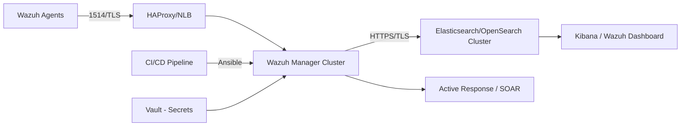

# High‑Level Design (HLD) — Mini SOC

**Document version:** 1.0

**Author:** Technical Architect

**Audience:** SOC leadership, platform engineers, SRE/DevOps, security architects

**Purpose:** Provide a concise, decision‑quality high‑level design deliverable of the Mini SOC project. This HLD covers context & goals, assumptions and constraints, non‑functional requirements (availability, RPO/RTO, capacity), logical architecture (SIEM, SOAR, CI/CD, ingress, secrets, monitoring), HA strategy, data flows, security posture, capacity & scaling guidance, and risks with mitigations.

---

## 1. Context & Goals
**Project context:**
- Implement a Wazuh‑based SIEM with automated active response.
- Deliver a reproducible deployment using IaC (Ansible) to a Docker Swarm environment, plus CI/CD integration.

**Primary goals:**
1. Reliable, auditable detection of incidents and some automated mitigation.
2. Minimal operational overhead through automated deployments and centralized secrets management.
3. High availability for ingest & alerting; recoverability via DR and backups.
4. Clear observability: metrics, logs, and alerting for platform health.

**Assumptions:**
- Agents are Linux servers that forward auth logs to Wazuh agents.
- Target environment supports Docker Swarm and Ansible for configuration management.
- Organization provides an object store (S3 or S3-compatible) and a secrets manager (Vault or equivalent).

**Constraints:**
- Initial environment limited to modest capacity (e.g., 2 managers, 3 indexers) but must be scalable.
- Security policy mandates encrypted transport and centralized secret management.

---

## 2. Non‑Functional Requirements (NFRs)
- **Availability:** Ingest path (agents -> manager -> indexer) target 99.9% for staging; 99.95% for production.
- **RTO/RPO:**
  - RPO: 15 minutes for alerts (hot snapshot frequency); 24 hours for dashboard artifacts.
  - RTO: 1 hour for manager restore; 2 hours for indexer restore (depends on snapshot transfer time).
- **Performance & Capacity:** initial support for 2,000 agents at 1 EPS each (2,000 EPS) with headroom to 6,000 EPS via horizontal scaling.
- **Latency:** detection to notification (Slack) ≤ 30 seconds for critical rules.
- **Security:** TLS mandatory; secrets stored in Vault; least privilege enforced via service accounts.

---

## 3. Logical Architecture
**Components & responsibilities:**
- **Wazuh Agents:** Collect logs, ship to manager securely.
- **Wazuh Manager:** Decoding, correlation, active response controller, integrations (Slack, webhook).
- **Indexer (Elasticsearch/OpenSearch):** Storage & search of alerts and events.
- **Dashboard (Kibana/Wazuh Dashboard):** Visualization and analyst workflows.
- **Active Response / SOAR:** Wazuh active response scripts (block-ip) or external SOAR for orchestration.
- **Ingress / Load Balancer:** HAProxy or Cloud NLB for agent traffic and dashboard access.
- **CI/CD:** GitHub/GitLab Actions (CI) + Ansible (CD) to deploy rule updates and manager artifacts to Swarm/K8s.
- **Secrets Management:** HashiCorp Vault (recommended) to store webhooks, DB creds, TLS certs.
- **Monitoring:** Prometheus + Grafana for infra metrics; ELK/metrics for logs.

**High‑level diagram (Mermaid)**

---

## 4. High Availability Strategy
- **Managers:** Active/Passive pair with HAProxy balancing; use shared storage or replicated configs. Use policy to avoid automatic split‑brain; ensure single active manager.
- **Indexer:** Minimum 3 master‑eligible nodes (odd number) for quorum; data nodes scaled horizontally; replica shards = 1 as baseline.
- **Dashboard:** Multiple instances behind LB.
- **Load balancing & failover:** HAProxy for agent connections with health checks to route to available manager.

---

## 5. Data Flow
1. **Agent -> Manager:** Agents forward logs (TLS) to manager (1514). Manager decodes and evaluates rules.
2. **Manager -> Indexer:** Alerts and parsed events forwarded to ES/Opensearch indices (`wazuh-alerts-*`).
3. **Manager -> Integrations:** On rule match (100020), manager triggers Slack/Teams webhook and active response script to block IP.
4. **CI/CD -> Manager:** Developers push rule changes to Git; CI runs tests and Ansible pushes updates to manager or image artifacts to Swarm/K8s.

---

## 6. Security Posture
- **Trust boundaries:** Agents (untrusted) -> Managers (trusted). Manager to Indexer is trusted zone. External systems (Slack) are 3rd party.
- **Transport security:** mTLS or TLS for agent↔manager and manager↔indexer. Enforce TLS 1.2+.
- **Secrets:** Store all secrets (webhooks, DB creds, TLS keys) in Vault. CI pulls short lived tokens for deployment.
- **IAM & least privilege:** Service accounts for manager, indexer, dashboard; API keys scope‑limited.
- **Auditing:** All administrative actions logged and shipped to SIEM.

---

## 7. Capacity & Scaling
- **EPS targets:** design for 2k EPS baseline, scale to 6k EPS.
- **Storage sizing:** assume 1 KB/event; storage multiplier 2.5x -> ~432 GB/day at 2k EPS. Hot retention 90 days -> ~39 TB (use ILM to move warm/cold).
- **Scaling approach:** scale ES data nodes horizontally; add ingest nodes; scale manager replicas (active/passive) and HAProxy.

---

## 8. Risks & Mitigations
- **False positives & mass blocking:** use time‑boxed auto‑block with operator approval for persistent blocks.
- **Snapshot latency for DR:** choose closer S3 region or use multi‑region replication.
- **Secret compromise:** Vault with strict ACLs and rotation policies.
- **ES performance bottleneck:** enable ILM, monitor JVM, and autoscale data nodes.

---

## 9. Operational Considerations
- **Monitoring:** Prometheus exporters for ES, manager, and system metrics. Dashboards for capacity and latency.
- **Oncall & runbooks:** Provide runbooks for manager failover, indexer recovery, and active response rollback.
- **Change management:** CI/CD pipeline with staging, acceptance tests (`ossec-logtest`), and manual gate to production.
